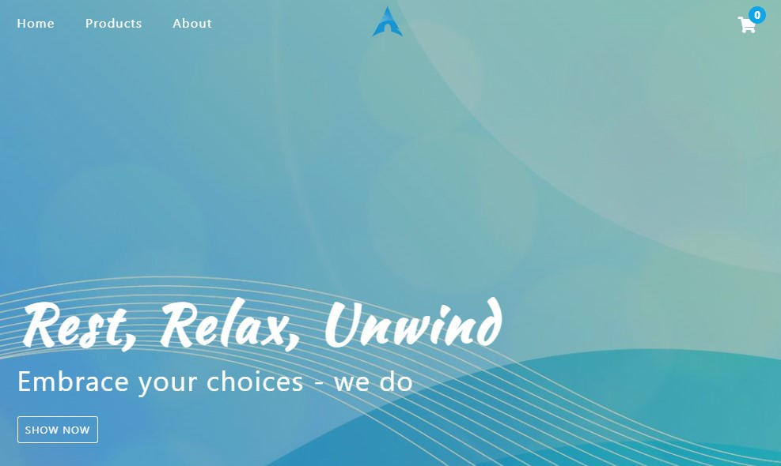

## Comfy Store !  🛋️ 🛏️ 🪑
 

## Nesta aplicação E-commece, temos as funcionalidades :
- Pesquisa e filtragem dos produtos ;
- Adicionar e excluir os produtos do carrinho ;
 ## O código foi desenvolvido usando os conceitos e funcionaldades :
- DOM
- EventListener
- filter
- getElement
- map
- fetch com async await
- consumindo APIs externas para os produtos.
## Uma loja virtual super confortável e agradável aos olhos de quem navega por ela. 💻 📚
 

## Tecnologias que utilizei para o projeto ;  

 
    
    
    

 

## Projeto 🥰

### [Comfy Store](https://alisson-aguiars2k.github.io/comfy-store/) 🔗